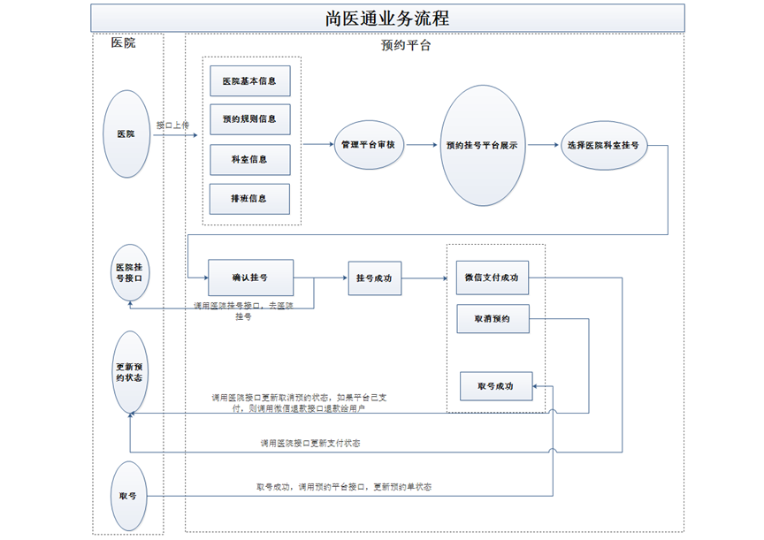
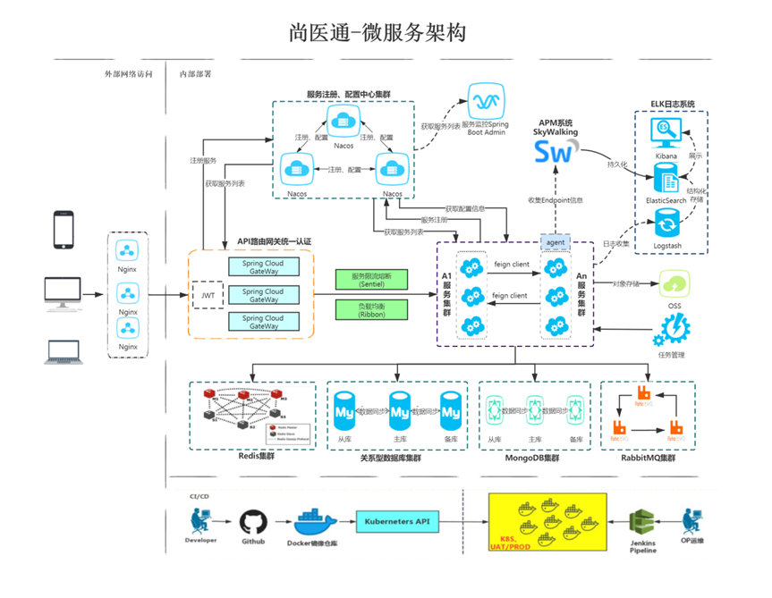

# 尚医通预约挂号平台

### 项目简介
尚医通即为网上预约挂号系统，网上预约挂号是近年来开展的一项便民就医服务，旨在缓解看病难、挂号难的就医难题，许多患者为看一次病要跑很多次医院，最终还不一定能保证看得上医生。网上预约挂号全面提供的预约挂号业务从根本上解决了这一就医难题。随时随地轻松挂号！不用排长队！

### 业务流程


### 服务架构


### 项目功能
#### 管理端
1、医院设置管理
（1）医院设置列表、添加、锁定、删除
（2）医院列表、详情、排班、下线

2、数据管理
（1）数据字典树形显示、导入、导出

3、用户管理
（1）用户列表、查看、锁定
（2）认证用户审批

4、订单管理
（1）订单列表、详情

5、统计管理
（1）预约统计

#### 用户端
1、首页数据显示
（1）医院列表

2、医院详情显示
（1）医院科室显示

3、用户登录功能
（1）手机号登录（短信验证码发送）
（2）微信扫描登录

4、用户实名认证

5、就诊人管理
（1）列表、添加、详情、删除


### 技术栈
1、SpringBoot

2、SpringCloud
（1）Nacos注册中心
（2）Feign
（3）GateWay

3、Redis
（1）使用Redis作为缓存
（2）验证码有效时间、支付二维码有效时间

4、MongoDB
（1）使用MongoDB存储 医院相关数据

5、EasyExcel
（1）操作excel表格，进行读和写操作

6、MyBatisPlus

7、RabbitMQ
（1）订单相关操作，发送mq消息

8、Docker
（1）下载镜像 docker pull
（2）创建容器 docker run

9、阿里云OSS

10、阿里云短信服务(由于企业限制，用容联云代替)

11、微信登录/支付

12、定时任务

### 项目结构
```text
--appointment-register 根目录，管理子模块：
    --hospital-manage：医院接口模拟端（已开发，直接使用）
    --common：公共模块父节点
        --common-util：工具类模块，所有模块都可以依赖于它
        --rabbit-util：rabbitmq业务封装
        --service-util：service服务的工具包，包含service服务的公共配置类，所有service模块依赖于它
    --server-gateway：服务网关
    --model：实体类模块
    --service：api接口服务父节点
        --service-hosp：医院api接口服务
        --service-cmn：公共api接口服务
        --service-user：用户api接口服务
        --service-order：订单api接口服务
        --service-oss：文件api接口服务
        --service-sms：短信api接口服务
        --service-email：邮箱api接口服务(已完成但未使用)
        --service-task：定时任务服务
        --service-statistics：统计api接口服务
        --service-user：用户api接口
    --service-client：feign服务调用父节点
        --service-cmn-client：公共api接口
        --service-hosp-client：医院api接口
        --service-order-client：订单api接口
```

### 运行项目
1. 现在service-oss application.yml设置阿里云oss的参数
```yaml
# 阿里云oss参数
aliyun:
  oss:
    endpoint: 
    accessKeyId: 
    secret:
    bucket: 
```
2. service-sms application.yml中设置容联云的短信测试参数
```yaml
# 容联云中测试参数
cloopen:
  sms:
    url: app.cloopen.com
    port: 8883
    accountSid: 
    accountToken: 
    appId:
```
3. 注意修改数据库参数
4. 启动service下的模块及service-gateway、hospital-manage模块

